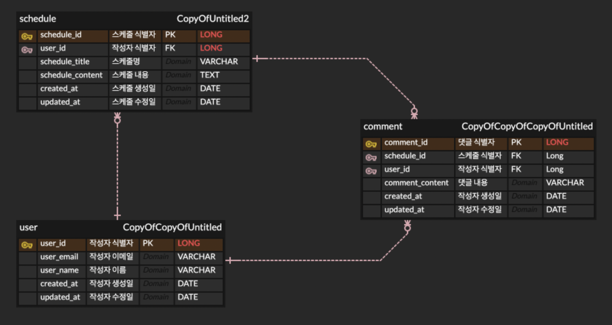

# 📅 Jpa-Scheduler API 문서

---

## 📌 목적

간단한 일정 관리 API를 통해 RESTful 서비스를 설계하고 JDBC 사용법 및 Spring 학습

## 🎯 레벨

- ✅ **LV0** ➡️ API명세서, ERD, SQL 작성️
- ✅ **LV1** ➡️ 일정 CRUD 구현
- ✅ **LV2** ➡️ 유저 CRUD 구현
- ✅ **LV3** ➡️ 비밀번호(회원가입)
- ✅ **LV4** ➡️ 로그인(인증) - Cookie/Session
- ✅ **LV5** ➡️ 예외발생 처리
- ✅ **LV6** ➡️ 비밀번호 암호화
- ✅ **LV7** ➡️ 댓글 CRUD 구현
- ✅ **LV8** ➡️ 일정 페이징 조회

## 📁 패키지 구조

```json

```

## 🖥 사용 기술

- 🛠 **java 17**
- 🛠 **springboot 3.4**
- 🛠 **lombok 1.18**
- 🛠 **mysql connector 8**
- 🛠 **spring data jpa**
- 🛠 **swagger**

## 📌 ERD


---

## 📘 API 명세서 요약

## schedule

| No                 | Method | Description | URL                                | Request      | Response |
|--------------------|--------|-------------|------------------------------------|--------------|----------|
| [1](#1-일정-생성)      | POST   | 일정 생성       | /api/schedule/create               | RequestBody  | 200 OK   |
| [2](#2-선택-일정-조회)   | GET    | 선택 일정 조회    | /api/schedule/search/{schedulerId} | PathVariable | 200 OK   |
| [3](#3-선택-일정-수정)   | PUT    | 선택 일정 수정    | /api/schedule/udpate               | RequestBody  | 200 OK   |
| [4](#4-선택-일정-삭제)   | DELETE | 선택 일정 삭제    | /api/schedule/delete{schedulerId}  | PathVariable | 200 OK   |
| [13](#13-전체-일정-조회) | GET    | 전체 일정 조회    | /api/schedule/list                 | RequestParam | 200 OK   |

## user

| No            | Method | Description | URL                       | Request      | Response |
|---------------|--------|-------------|---------------------------|--------------|----------|
| [5](#5-유저-생성) | POST   | 유저 생성       | /api/user/create          | RequestBody  | 200 OK   |
| [6](#6-유저-조회) | GET    | 유저 조회       | /api/user/search/{userId} | PathVariable | 200 OK   |
| [7](#7-유저-수정) | PUT    | 유저 수정       | /api/user/update          | RequestBody  | 200 OK   |
| [8](#8-유저-삭제) | DELETE | 유저 삭제       | /api/user/delete/{userId} | PathVariable | 200 OK   |

## comment

| No              | Method | Description | URL                             | Request      | Response |
|-----------------|--------|-------------|---------------------------------|--------------|----------|
| [9](#9-댓글-생성)   | POST   | 댓글 생성       | /api/comment/create             | RequestBody  | 200 OK   |
| [10](#10-댓글-조회) | GET    | 댓글 조회       | /api/comment/search/{commentId} | PathVariable | 200 OK   |
| [11](#11-댓글-수정) | PUT    | 댓글 수정       | /api/comment/update             | RequestBody  | 200 OK   |
| [12](#12-댓글-삭제) | DELETE | 댓글 삭제       | /api/comment/delete/{commetId}  | PathVariable | 200 OK   |

---

## 🔽 상세 API 설명

### 1. 일정 생성

- **URL** : `/api/schedule/create`
- **Method** : `POST`

### 1-1. Request

- **Request Body**

```json
{
  "userId": Long,
  "scheduleTitle": String,
  "scheduleContent": String
}
```

---

### 1-2. Response

- **Response Body**

```json
{
  "scheduleId": Long
}
```

---

### 2. 선택 일정 조회

- **URL** : `/api/schedule/search`
- **Method** : `GET`

### 2-1. Request

- **PathVariable**
    - **URL 예시** : `/api/schedule/search/{scheduleId}`

---

### 2-2. Response

- **Response Body**

```json

{
  "scheduleId": Long
  "userId": Long,
  "scheduleTitle": String,
  "scheduleContent": String,
  "createdAt": Timestamp(yyyy-MM-dd
  HH: mm),
  "updatedAt": Timestamp(yyyy-MM-dd
  HH: mm)
}

```

---

### 3. 선택 일정 수정

- **URL** : `/api/schedule/update`
- **Method** : `PUT`

### 3-1. Request

- **RequestBody**

```json
{
  "scheduleId": Long,
  "scheduleTitle": String,
  "scheduleContent": String
}    
```

---

### 3-2. Response

- **Response Body**

```json
{
  "scheduleId": Long
}
```

---

### 4. 선택 일정 삭제

- **URL** : `/api/schedule/delete`
- **Method** : `DELETE`

### 4-1. Request

- **PathVariable**
    - **URL 예시** : `/api/schedule/delete/{scheduleId}`

### 4-2. Response

- **Response Body**

```json
  {
  "scheduleId": Long
}

```

### 5. 유저 생성

- **URL** : `/api/user/create`
- **Method** : `POST`

### 5-1. Request

- **Request Body**

```json
{
  "userName": String,
  "userPassword": String,
  "userEmail": String
}
```

---

### 5-2. Response

- **Response Body**

```json
{
  "userId": Long
}
```

---

### 6. 유저 조회

- **URL** : `/api/user/search`
- **Method** : `GET`

### 6-1. Request

- **PathVariable**
    - **URL 예시** : `/api/user/search/{userId}`

---

### 6-2. Response

- **Response Body**

```json

{
  "userId": Long
  "userName": String,
  "userEmail": String,
  "createdAt": Timestamp(yyyy-MM-dd
  HH: mm),
  "updatedAt": Timestamp(yyyy-MM-dd
  HH: mm)
}

```

---

### 7. 유저 수정

- **URL** : `/api/user/update`
- **Method** : `PUT`

### 7-1. Request

- **RequestBody**

```json
{
  "userId": Long,
  "userName": String,
  "userEmail": String
}    
```

---

### 7-2. Response

- **Response Body**

```json
{
  "userId": Long
}
```

---

### 8. 유저 삭제

- **URL** : `/api/user/delete`
- **Method** : `DELETE`

### 8-1. Request

- **PathVariable**
    - **URL 예시** : `/api/user/delete/{userId}`

### 8-2. Response

- **Response Body**

```json
{
  "userId": Long
}

```

### 9. 댓글 생성

- **URL** : `/api/comment/create`
- **Method** : `POST`

#### 9-1. Request

- **Request Body**

```json
{
  "userId": Long,
  "scheduleId": Long,
  "commentContent": String
}
```

#### 9-2. Response

- **Response Body**

```json
{
  "commentId": Long
}
```

---

### 10. 댓글 조회

- **URL** : `/api/comment/search`
- **Method** : `GET`

#### 10-1. Request

- **PathVariable**
    - **URL 예시** : `/api/comment/search/{commentId}`

#### 10-2. Response

- **Response Body**

```json
{
  "commentId": Long,
  "commentContent": String,
  "userId": Long,
  "scheduleId": Long,
  "createdAt": Timestamp(yyyy-MM-dd
  HH: mm),
  "updatedAt": Timestamp(yyyy-MM-dd
  HH: mm)
}
```

---

### 11. 댓글 수정

- **URL** : `/api/comment/update`
- **Method** : `PUT`

#### 11-1. Request

- **Request Body**

```json
{
  "commentId": Long,
  "commentContent": String
}
```

#### 11-2. Response

- **Response Body**

```json
{
  "commentId": Long
}
```

---

### 12. 댓글 삭제

- **URL** : `/api/comment/delete`
- **Method** : `DELETE`

#### 12-1. Request

- **PathVariable**
    - **URL 예시** : `/api/comment/delete/{commentId}`

#### 12-2. Response

- **Response Body**

```json
{
  "commentId": Long
}
```

### 13. 전체 일정 조회

- **URL** : `/api/schedule/list`
- **Method** : `GET`

#### 13-1. Request

- **RequestParam**
    - **URL 예시** : `/api/comment/list?pageNumber=1&size=10`
    - **desc** : `pageNumber default 값 0, size default 값 10`

#### 13-2. Response

- **Response Body**

```json
{
  "content": [
    {
      "scheduleId": 26,
      "scheduleTitle": "test",
      "scheduleContent": "스케줄 내용 test",
      "userId": 23,
      "createdAt": "2025-05-26 14:10",
      "updatedAt": "2025-05-26 14:10"
    },
    {
      "scheduleId": 27,
      "scheduleTitle": "test",
      "scheduleContent": "스케줄 내용 test",
      "userId": 23,
      "createdAt": "2025-05-26 14:10",
      "updatedAt": "2025-05-26 14:10"
    },
    {
      "scheduleId": 28,
      "scheduleTitle": "test",
      "scheduleContent": "스케줄 내용 test",
      "userId": 23,
      "createdAt": "2025-05-26 14:10",
      "updatedAt": "2025-05-26 14:10"
    },
    {
      "scheduleId": 29,
      "scheduleTitle": "test",
      "scheduleContent": "스케줄 내용 test",
      "userId": 23,
      "createdAt": "2025-05-26 14:10",
      "updatedAt": "2025-05-26 14:10"
    },
    {
      "scheduleId": 30,
      "scheduleTitle": "test",
      "scheduleContent": "스케줄 내용 test",
      "userId": 23,
      "createdAt": "2025-05-26 14:10",
      "updatedAt": "2025-05-26 14:10"
    },
    {
      "scheduleId": 31,
      "scheduleTitle": "test",
      "scheduleContent": "스케줄 내용 test",
      "userId": 23,
      "createdAt": "2025-05-26 14:10",
      "updatedAt": "2025-05-26 14:10"
    },
    {
      "scheduleId": 32,
      "scheduleTitle": "test",
      "scheduleContent": "스케줄 내용 test",
      "userId": 23,
      "createdAt": "2025-05-26 14:10",
      "updatedAt": "2025-05-26 14:10"
    },
    {
      "scheduleId": 33,
      "scheduleTitle": "test",
      "scheduleContent": "스케줄 내용 test",
      "userId": 23,
      "createdAt": "2025-05-26 14:10",
      "updatedAt": "2025-05-26 14:10"
    },
    {
      "scheduleId": 34,
      "scheduleTitle": "test",
      "scheduleContent": "스케줄 내용 test",
      "userId": 23,
      "createdAt": "2025-05-26 14:10",
      "updatedAt": "2025-05-26 14:10"
    },
    {
      "scheduleId": 35,
      "scheduleTitle": "test",
      "scheduleContent": "스케줄 내용 test",
      "userId": 23,
      "createdAt": "2025-05-26 14:10",
      "updatedAt": "2025-05-26 14:10"
    }
  ],
  "pageable": {
    "pageNumber": 1,
    "pageSize": 10,
    "sort": {
      "sorted": false,
      "unsorted": true,
      "empty": true
    },
    "offset": 10,
    "paged": true,
    "unpaged": false
  },
  "totalPages": 3,
  "totalElements": 22,
  "last": false,
  "numberOfElements": 10,
  "first": false,
  "size": 10,
  "number": 1,
  "sort": {
    "sorted": false,
    "unsorted": true,
    "empty": true
  },
  "empty": false
}
```