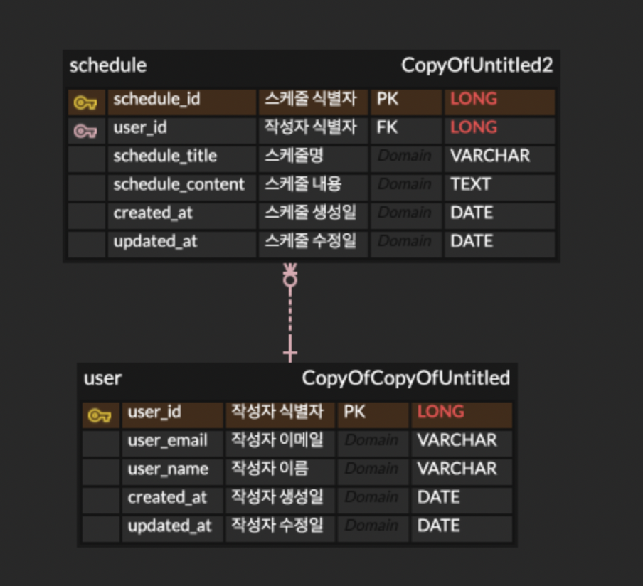

# 📅 Jpa-Scheduler API 문서

---

## 📌 목적

간단한 일정 관리 API를 통해 RESTful 서비스를 설계하고 JDBC 사용법 및 Spring 학습

## 🎯 레벨

- ✅ **LV0** ➡️ API명세서, ERD, SQL 작성️
- ✅ **LV1** ➡️ 일정 CRUD 구현
- ✅ **LV2** ➡️ 유저 CRUD 구현
- ✅ **LV3** ➡️ 비밀번호(회원가입)
- ✅ **LV4** ➡️ 로그인(인증) - Cookie/Session
- ✅ **LV5** ➡️ 예외발생 처리
- ✅ **LV6** ➡️ 비밀번호 암호화
- ✅ **LV7** ➡️ 댓글 CRUD 구현
- ✅ **LV8** ➡️ 일정 페이징 조회

## 📁 패키지 구조

```json

```

## 🖥 사용 기술

- 🛠 **java 17**
- 🛠 **springboot 3.4**
- 🛠 **lombok 1.18**
- 🛠 **mysql connector 8**
- 🛠 **spring data jpa**
- 🛠 **swagger**

## 📌 ERD


---

## 📘 API 명세서 요약

## schedule

| No               | Method | Description | URL                                | Request      | Response |
|------------------|--------|-------------|------------------------------------|--------------|----------|
| [1](#1-일정-생성)    | POST   | 일정 생성       | /api/schedule/create               | RequestBody  | 200 OK   |
| [2](#2-선택-일정-조회) | GET    | 선택 일정 조회    | /api/schedule/search/{schedulerId} | PathVariable | 200 OK   |
| [3](#3-선택-일정-수정) | PUT    | 선택 일정 수정    | /api/schedule/udpate               | RequestBody  | 200 OK   |
| [4](#4-선택-일정-삭제) | DELETE | 선택 일정 삭제    | /api/schedule/delete{schedulerId}  | PathVariable | 200 OK   |

## user

| No            | Method | Description | URL                       | Request      | Response |
|---------------|--------|-------------|---------------------------|--------------|----------|
| [5](#5-유저-생성) | POST   | 유저 생성       | /api/user/create          | RequestBody  | 200 OK   |
| [6](#6-유저-조회) | GET    | 유저 조회       | /api/user/search/{userId} | PathVariable | 200 OK   |
| [7](#7-유저-수정) | PUT    | 유저 수정       | /api/user/update          | RequestBody  | 200 OK   |
| [8](#8-유저-삭제) | DELETE | 유저 삭제       | /api/user/delete/{userId} | PathVariable | 200 OK   |

## comment

| No              | Method | Description | URL                             | Request      | Response |
|-----------------|--------|-------------|---------------------------------|--------------|----------|
| [9](#9-댓글-생성)   | POST   | 댓글 생성       | /api/comment/create             | RequestBody  | 200 OK   |
| [10](#10-댓글-조회) | GET    | 댓글 조회       | /api/comment/search/{commentId} | PathVariable | 200 OK   |
| [11](#11-댓글-수정) | PUT    | 댓글 수정       | /api/comment/update             | RequestBody  | 200 OK   |
| [12](#12-댓글-삭제) | DELETE | 댓글 삭제       | /api/comment/delete/{commetId}  | PathVariable | 200 OK   |

---

## 🔽 상세 API 설명

### 1. 일정 생성

- **URL** : `/api/schedule/create`
- **Method** : `POST`

### 1-1. Request

- **Request Body**

```json
{
  "userId": Long,
  "scheduleTitle": String,
  "scheduleContent": String
}
```

---

### 1-2. Response

- **Response Body**

```json
{
  "scheduleId": Long
}
```

---

### 2. 선택 일정 조회

- **URL** : `/api/schedule/search`
- **Method** : `GET`

### 2-1. Request

- **PathVariable**
    - **URL 예시** : `/api/schedule/search/{scheduleId}`

---

### 2-2. Response

- **Response Body**

```json

{
  "scheduleId": Long
  "userId": Long,
  "scheduleTitle": String,
  "scheduleContent": String,
  "createdAt": Timestamp(yyyy-MM-dd
  HH: mm),
  "updatedAt": Timestamp(yyyy-MM-dd
  HH: mm)
}

```

---

### 3. 선택 일정 수정

- **URL** : `/api/schedule/update`
- **Method** : `PUT`

### 3-1. Request

- **RequestBody**

```json
{
  "scheduleId": Long,
  "scheduleTitle": String,
  "scheduleContent": String
}    
```

---

### 3-2. Response

- **Response Body**

```json
{
  "scheduleId": Long
}
```

---

### 4. 선택 일정 삭제

- **URL** : `/api/schedule/delete`
- **Method** : `DELETE`

### 4-1. Request

- **PathVariable**
    - **URL 예시** : `/api/schedule/delete/{scheduleId}`

### 4-2. Response

- **Response Body**

```json
  {
  "scheduleId": Long
}

```

### 5. 유저 생성

- **URL** : `/api/user/create`
- **Method** : `POST`

### 5-1. Request

- **Request Body**

```json
{
  "userName": String,
  "userPassword": String,
  "userEmail": String
}
```

---

### 5-2. Response

- **Response Body**

```json
{
  "userId": Long
}
```

---

### 6. 유저 조회

- **URL** : `/api/user/search`
- **Method** : `GET`

### 6-1. Request

- **PathVariable**
    - **URL 예시** : `/api/user/search/{userId}`

---

### 6-2. Response

- **Response Body**

```json

{
  "userId": Long
  "userName": String,
  "userEmail": String,
  "createdAt": Timestamp(yyyy-MM-dd
  HH: mm),
  "updatedAt": Timestamp(yyyy-MM-dd
  HH: mm)
}

```

---

### 7. 유저 수정

- **URL** : `/api/user/update`
- **Method** : `PUT`

### 7-1. Request

- **RequestBody**

```json
{
  "userId": Long,
  "userName": String,
  "userEmail": String
}    
```

---

### 7-2. Response

- **Response Body**

```json
{
  "userId": Long
}
```

---

### 8. 유저 삭제

- **URL** : `/api/user/delete`
- **Method** : `DELETE`

### 8-1. Request

- **PathVariable**
    - **URL 예시** : `/api/user/delete/{userId}`

### 8-2. Response

- **Response Body**

```json
{
  "userId": Long
}

```
